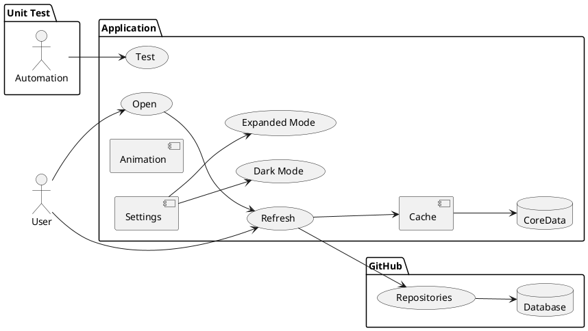

# SwiftUIGitHubClient
Swift UI Github Client

## Reason
The objective of this is to create a straightforward, single-screen application that displays the latest trending repositories on Github, using data sourced from a public API. And this is a Minimum Viable Product (MVP).

## Architecture
Swift / SwiftUI
iOS16 minimum
Core Data
Animations: Lottie (on error) & Shimmer (loading)
Settings: use cache / show animation

## The app
It fetchs the trending repositories from the provided public API and display it to the users, it uses cache, but the user could refresh the information.
CoreData helps to show cached information.

  
Use Cases

  
  ### plantuml

