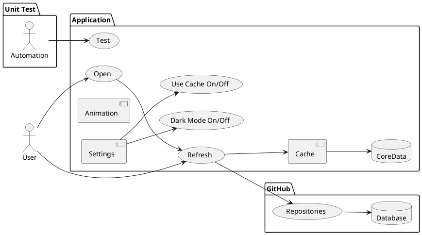
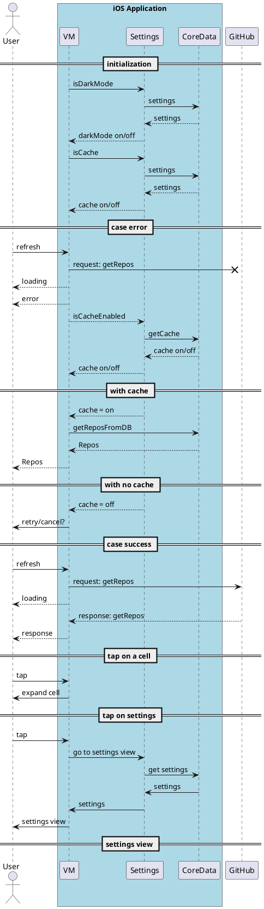

# SwiftUIGitHubClient
Swift UI Github Client

## Reason
The objective of this is to create a straightforward, single-screen application that displays the latest trending repositories on Github, using data sourced from a public API. And this is a Minimum Viable Product (MVP).

## Architecture
SwiftUI, just MVC without the C, that means MV (declarative, post-reactive).
Unit Tests enabled.
iOS16 minimum
Core Data
Animations: Lottie (on error) & Shimmer (loading)
Settings: use cache / dark mode / expanded mode

## Public API
Here is the Github public api (https://api.github.com/search/repositories?q=language=+sort:stars)
We are going to use only reduced information of every repository item:
* Name: items[].name
* Full Name: items[].full_name
* Description: items[].description
* Owner avatar url (icon): items[].owner.avatar_url
* Language: items[].language
* Number of starts: items[].stargazers_count
  
<details>
  <summary>Example: </summary>
   
  
```json
{
  "items": [
  {
      "name": "go",
      "full_name": "golang/go",
      "description": "The Go programming language"
      "owner": {
        "avatar_url": "https://avatars.githubusercontent.com/u/4314092?v=4"
      },
      "language": "Go",
      "stargazers_count": 119467
  }]
}
```
</details>


## The app
It fetchs the trending repositories from the provided public API and display it to the users, it uses cache, but the user could refresh the information.
CoreData helps to show cached information.

### Use Case


<details>
  <summary>use case in plant uml</summary>
  


</details>

## Model View (MV)
In SwiftUI we are going to use a natural way, there's no need of MVVM here, we just adopt MV.
* In app, we store and process data by using a data model that is separate from it's UI, Data & Logic will be inside Repository.
* Adopting the ObservableObject protocol for model class (Repository).
* Use ObservableObject where we need to manager the life cycle of the data.
* Typically the ObservableObject is part of the model.


<details>
  <summary>Mind map of the model in plantuml</summary>
  

</details>

## Sequence

Sequence diagram of the app.


<details>
  <summary>Sequence in plantuml</summary>
  

</details>
